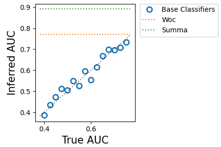

[](https://github.com/robert-vogel/pySUMMA/actions/workflows/unittests.yml)

# summa Ensemble Package

This package provides an implementation of aggregation strategies 
for binary classification:

1. Strategy for Unsupervised Multiple Method Aggregation (SUMMA) [1]
2. Wisdom of Crowds (WOC) aggregation strategy [2]
3. Spectral Metalearner (SML) [3]

and applies the method from [4] to compute the singular value associated with specific
elements of the third central moment tensor.  For references, [see below](https://github.com/robert-vogel/pySUMMA/edit/main/README.md#references).

## Dependencies

To use this package you will need:

- Python (3.7--3.11)
- numpy (1.22.4)
- scipy (1.6.3)
- matplotlib (3.5.2)

:warning: This package could not be validated with computers using Apple Silicon,
as SciPy cannot be easily installed with this computer architecture.

## Installation

```bash
python -m pip install --user git+https://github.com/robert-vogel/pySUMMA.git@main
```

## Examples

Here we show how to simulate data with the `simulate` module, apply
classifiers to data with the `classifiers` module, and lastly generate
a simple plot to interpret the method.  The plot presents the 
correlation between the inferred and true base classifier performances and
a comparison of aggregation performances.


### Summa classifier

In this example we apply the `classifiers.Summa` and `classifiers.RankWoc` classifiers to 
simulated conditionally independent rank order predictions using `simulate.EnsembleRankPredictions`.

```python
from summa import classifiers as cls
from summa import simulate, plot, stats

# define simulation parameters. 
m_classifiers = 15
auc = (0.4, 0.75)

n_samples = 2500
prevalence = 0.3
n_positive_samples = int(prevalence * n_samples)
```

Simulate data

```python
sim = simulate.EnsembleRankPredictions(m_cls=m_classifiers,
                    auc=auc)
data, labels = sim.sample(n_samples, n_positive_samples)
```

Instantiate the aggregation classifiers and apply to the simulated data.

```python
cl_summa = cls.Summa()
cl_summa.fit(data)

# Compare inferred and true positive class prevalence
print("Positive Class Prevalence\n"
        f"Inferred:\t{cl_summa.prevalence:0.3f}\n"
        f"True:\t\t{prevalence:0.3f}")

cl_woc = cls.RankWoc()
cl_woc.fit(data)
```

Measure the performance of each aggregation classifier by computing
the AUC from the `stats.roc` tool.

```python
cls_auc = {}
_fpr, _tpr, cls_auc["Woc"] = stats.roc(cl_woc.get_scores(data), labels)
_fpr, _tpr, cls_auc["Summa"] = stats.roc(cl_summa.get_scores(data), labels)
```

Print plot as a pdf in the current directory.

```python
plot.performance(sim.auc, cl_summa.auc, cls_auc, savename="summa_auc.pdf")
```




## SML

See Parisi et al. [3] for details on SML and Jaffe et al. [4] 
about the decomposition of the third central moment tensor.

### Example

:construction: **Under construction**

## Cite Us

Please don't forget to cite our manuscript:

```
@article{Ahsen2020JournalCompBio,
    author = {Ahsen, Mehmet Eren and Vogel, 
        Robert and Stolovitzky, Gustavo A.},
    title = {R/PY-SUMMA: An R/Python Package for Unsupervised 
                Ensemble Learning for Binary Classification 
                Problems in Bioinformatics},
    journal = {Journal of Computational Biology},
    volume = {27},
    number = {9},
    pages = {1337--1340},
    year = {2020},
    doi = {10.1089/cmb.2019.0348},
    note ={PMID: 31905016},
    eprint = {https://doi.org/10.1089/cmb.2019.0348}
}
```

## References

1. [M.E. Ahsen, R.M. Vogel, and G.A. Stolovitzky. Unsupervised Evaluation and Weighted Aggregation of Ranked Classification Predictions. *J. Mach. Learn. Res.* 20, 2019.](https://www.jmlr.org/papers/volume20/18-094/18-094.pdf)
2. [D. Marbach, *et al.* Wisdom of crowds for robust gene network inference. *Nature methods*, 9(8):796, 2012.](https://www.nature.com/articles/nmeth.2016)
3. [F. Parisi, *et al.* Ranking and combining multiple predictors without labeled data. *Proceedings of the National Academy of Sciences*, 111(4):1253--1258, 2014.](https://www.pnas.org/doi/abs/10.1073/pnas.1219097111)
4. [A. Jaffe, B. Nadler, and Y. Kluger. Estimating the accuracies of multiple classifiers without labeled data. Proceedings of the Eighteenth International Conference on Artificial Intelligence and Statistics: *Proc. Mach. Learn. Res.*, 38:407--415, 2015.](http://proceedings.mlr.press/v38/jaffe15.html)
